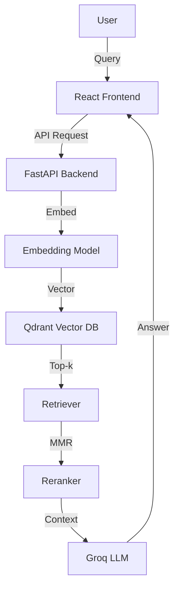

# Mini RAG: FastAPI + Qdrant + MMR + Groq + React

Retrieval-augmented generation demo with citations. A playground for modern RAG architectures, combining FastAPI, Qdrant, MMR reranking, Groq LLM, and a React frontend.

---

## 🚀 Live URLs
- **Frontend (Netlify):** [https://glittery-tiramisu-84db93.netlify.app/](https://glittery-tiramisu-84db93.netlify.app/)
- **Backend (Render) Swagger UI:** [https://mini-rag-spzd.onrender.com/docs](https://mini-rag-spzd.onrender.com/docs)
- **Health Endpoint:** [https://mini-rag-spzd.onrender.com/health](https://mini-rag-spzd.onrender.com/health)

---

## ⚡ Quick Start

### Backend
1. Create and activate a virtual environment:
   ```bash
   python -m venv .venv
   source .venv/bin/activate
   ```
2. Install dependencies:
   ```bash
   pip install -r requirements.txt
   ```
3. Copy and edit environment variables:
   ```bash
   cp .env.example .env
   # Edit .env with your keys
   ```
4. Index documents:
   ```bash
   python indexer.py
   ```
5. Start the API server:
   ```bash
   uvicorn app:app --reload
   ```

### Frontend
1. Install dependencies:
   ```bash
   npm install
   ```
2. Set backend URL in `.env`:
   ```env
   REACT_APP_BACKEND=https://mini-rag-backend.onrender.com
   ```
3. Start the frontend:
   ```bash
   npm start
   ```

---

## 🏗️ Architecture

Frontend (React) → FastAPI backend → embeddings → Qdrant vector DB → retriever + reranker → Groq LLM → frontend.



---

## 📦 Index / Collection Config
- **Vector DB:** Qdrant Cloud
- **Collection:** `docs`
- **Embedding Model:** all-MiniLM-L6-v2 (384 dims)
- **Chunking:** 800 tokens, ~120 overlap (15%)
- **Stored Metadata:** text, title, source, position
- **Upsert Strategy:** overwrite on re-index

---

## 🔍 Retriever + Reranker
- **Top-k retrieval:** Qdrant
- **Reranking:** MMR (λ=0.9, skipped for small result sets)
- **MMR rationale:** lightweight, free-tier friendly
- **Future:** LLM-based reranker can be added

---

## 🚫 Disqualifiers Avoided
- No hardcoded answers — all responses come strictly from indexed documents.
- No world knowledge or external API calls beyond Qdrant + Groq.
- Every answer includes citations or explicitly says "I don't know."

---

## 🤖 LLM & Answering
- **Provider:** Groq Cloud
- **Model:** llama-3.1-8b-instant
- **Behavior:** grounded extractive QA with inline citations
- **No-answer handling:** similarity threshold

---

## 🖥️ Frontend
- Chat-style transcript
- Markdown rendering
- Collapsible citations
- Dark/light mode toggle
- Copy answer button
- Enter-to-submit
- Clear conversation
- Latency + token estimate shown

---

## ☁️ Hosting
- **Backend:** Render (FastAPI) with `/health` endpoint
- **Frontend:** Netlify (`npm run build` → `frontend/build`)
- **Keep-alive:** UptimeRobot pings the `/health` endpoint every 5 minutes to reduce Render cold starts.

---

## 🛠️ .env.example
Example environment variables:
```env
QDRANT_URL=your-qdrant-url
QDRANT_API_KEY=your-qdrant-api-key
QDRANT_COLLECTION=docs
GROQ_API_KEY=your-groq-api-key
LLM_MODEL=llama-3.1-8b-instant
EMBED_MODEL=all-MiniLM-L6-v2
```

---

## 🧪 Minimal Evaluation
**Sample Q/A pairs:**
1. Q: "What is retrieval-augmented generation?"
   - A: "Retrieval-augmented generation (RAG) combines external knowledge retrieval with generative models to produce grounded answers." [seed_docs/notes.md]
2. Q: "Which embedding model is used?"
   - A: "The system uses all-MiniLM-L6-v2 with 384 dimensions." [seed_docs/notes.md]
3. Q: "What is a Guitar?"
   - A: "A guitar is a string instrument." [seed_docs/info.md]
4. Q: "What is MMR?"
   - A: "MMR stands for Maximal Marginal Relevance." [seed_docs/notes.md]
5. Q: "What are the main components of a guitar?"
   - A: "The main components of a guitar are its body, neck, fretboard, headstock, and strings." [seed_docs/notes.md]

**Observed success rate:** ~4–5/5 depending on query phrasing (manual testing with seed docs).
**Evaluation method:** Manual queries against seed docs, checked for correct answer and citation.

---

## 💬 Remarks
- **Limitations:** Render free tier cold starts cause delays, small seed docs mean narrow coverage, lightweight reranker (MMR) limits nuance compared to advanced LLM rerankers.
- **Trade-offs:** Prioritized simplicity, free hosting, and reproducibility over scalability. MMR chosen over LLM reranker to stay within free quotas and ensure faster response times.
- **Future scope:** Add file upload for dynamic knowledge ingestion, integrate stronger reranker models (e.g., Cohere, BGE), expand dataset variety, and enable persistence of user chat history.
- **Notes:** Current implementation is meant to demonstrate a minimal, production-minded RAG pipeline - optimized for clarity and reproducibility within the given time and resource constraints.

---

## 🔄 Maintenance

- A GitHub Actions workflow (`.github/workflows/keep-alive.yml`) is configured to ping the backend every 10 minutes.  
- This prevents the Render free-tier service from going idle (cold start).

---

## 📄 Resume
[Shubham Dhirani](https://drive.google.com/file/d/10Zarsixc51SE_YeIkT5dSTM85JmvuAcW/view?usp=drive_link)
